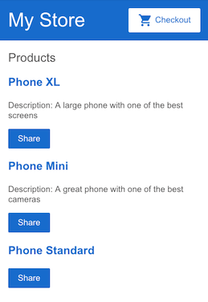
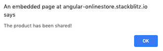

# Empezando con Angular

¡Bienvenido a Angular!

Este tutorial le presenta los conceptos básicos de Angular y lo guía a través de la creación de un sitio de comercio electrónico con un catálogo, un carrito de compras y un formulario de pago.

Para ayudarlo a comenzar de inmediato, este tutorial utiliza una aplicación lista para usar que puede examinar y modificar de forma interactiva en [StackBlitz](https://stackblitz.com/) — Sin tener que crear un entorno de trabajo local. StackBlitz es un entorno de desarrollo basado en navegador donde puede crear, guardar y compartir proyectos utilizando una variedad de tecnologías.

---

## Prerrequisitos

Para aprovechar al máximo este tutorial, ya debe tener un conocimiento básico de lo siguiente.

- [HTML](https://developer.mozilla.org/en-US/docs/Learn/HTML)
- [JavaScript](https://developer.mozilla.org/en-US/docs/Web/JavaScript)
- [TypeScript](https://www.typescriptlang.org/)

---

## Haga un recorrido por la aplicación de ejemplo

Construye aplicaciones de Angular con componentes. Los componentes definen áreas de responsabilidad en la interfaz de usuario que le permiten reutilizar conjuntos de funciones de la interfaz de usuario.

Un componente consta de tres cosas:

- **Una clase de componente** que maneja datos y funcionalidad.
- **Una plantilla HTML** que determina la interfaz de usuario.
- **Componentes de estilos específicos** que definen la apariencia.

Esta guía demuestra la creación de una aplicación con los siguientes componentes.

- `<app-root>`: El primer componente a cargar y el contenedor para los demás componentes.
- `<app-top-bar>`: El nombre de la tienda y el botón de pago.
- `<app-product-list>`: La lista de productos.
- `<app-product-alerts>`: Un componente que contiene las alertas de la aplicación.


Para obtener más información sobre los componentes, consulte [Introducción a los componentes](https://angular.io/guide/architecture-components).

---

## Crea el proyecto de muestra

Para crear el proyecto de muestra, genere el [proyecto de muestra listo para usar en StackBlitz](https://angular.io/generated/live-examples/getting-started-v0/stackblitz.html). Para guardar su trabajo:

1. Inicie sesión en StackBlitz.
2. Haga fork del proyecto que generaste.
3. Guarde periódicamente.

En StackBlitz, el panel de vista previa a la derecha muestra el estado inicial de la aplicación de ejemplo. La vista previa presenta dos áreas:

- una barra superior con el nombre de la tienda, _My Store_ y un botón de pago
- un encabezado para una lista de productos, _Products_


La sección del proyecto a la izquierda muestra los archivos de origen que componen la aplicación, incluida la infraestructura y los archivos de configuración.

Cuando genera las aplicaciones de ejemplo de StackBlitz que acompañan a los tutoriales, StackBlitz crea los archivos de inicio y los datos simulados por usted. Los archivos que usa a lo largo del tutorial están en la carpeta `src`.

Para obtener más información sobre cómo utilizar StackBlitz, consulte la
[Documentación de StackBlitz](https://developer.stackblitz.com/docs/platform/).

---

## Crea la lista de productos

En esta sección, actualizará la aplicación para mostrar una lista de productos. Utilizará datos de productos predefinidos del archivo `products.ts` y métodos del archivo `product-list.component.ts`. Esta sección lo guía a través de la edición del HTML, también conocido como plantilla.

1. En la carpeta `product-list`, abra el archivo de plantilla `product-list.component.html`.

2. Agregue una directiva estructural `*ngFor` en un `<div>`, de la siguiente manera.

   ```html
   <!-- src/app/product-list/product-list.component.html -->

   <h2>Products</h2>

   <div *ngFor="let product of products"></div>
   ```

   Con `*ngFor`, el `<div>` se repite para cada producto de la lista.

   Las directivas estructurales dan forma o remodelan la estructura del DOM, agregando, quitando y manipulando elementos. Para obtener más información sobre las directivas estructurales, consulte [Directivas estructurales](https://angular.io/guide/structural-directives).

3. Dentro de `<div>`, agregue un `<h3>` y `{{ product.name }}`. La declaración `{{ product.name }}` es un ejemplo de la sintaxis de interpolación de Angular. La interpolación `{{ }}` le permite representar el valor de la propiedad como texto.

   ```html
   <!-- src/app/product-list/product-list.component.html -->
   <h2>Products</h2>

   <div *ngFor="let product of products">
     <h3>{{ product.name }}</h3>
   </div>
   ```

   El panel de vista previa se actualiza para mostrar el nombre de cada producto en la lista.

   

4. Para hacer que el nombre de cada producto sea un enlace a los detalles del producto, agregue el elemento `<a>` alrededor `{{ product.name }}`.

5. Establezca el título para que sea el nombre del producto utilizando la sintaxis de enlace de propiedad `[ ]`, de la siguiente manera:

   ```html
   <!-- src/app/product-list/product-list.component.html -->
   <h2>Products</h2>

   <div *ngFor="let product of products">
     <h3>
       <a [title]="product.name + ' details'"> {{ product.name }} </a>
     </h3>
   </div>
   ```

   En el panel de vista previa, coloque el cursor sobre el nombre de un producto para ver el valor de la propiedad del nombre enlazado, que es el nombre del producto más la palabra "details". El enlace de propiedad `[ ]` le permite usar el valor de la propiedad en una expresión de plantilla.

   

6. Agregue las descripciones de los productos. En un elemento `<p>`, use una directiva `*ngIf` para que Angular solo cree el elemento `<p>` si el producto actual tiene una descripción.

   ```html
   <!-- src/app/product-list/product-list.component.html -->
   <h2>Products</h2>

   <div *ngFor="let product of products">
     <h3>
       <a [title]="product.name + ' details'"> {{ product.name }} </a>
     </h3>

     <p *ngIf="product.description">Description: {{ product.description }}</p>
   </div>
   ```

   La aplicación ahora muestra el nombre y la descripción de cada producto en la lista. Tenga en cuenta que el producto final no tiene un párrafo de descripción. Angular no crea el elemento `<p>` porque la propiedad de descripción del producto está vacía.

   

7. Agrega un botón para que los usuarios puedan compartir un producto. Vincula el evento `click` del botón al método `share()` en `product-list.component.ts`. El enlace de eventos usa un conjunto de paréntesis, `( )`, alrededor del evento, como en el evento `(click)` del elemento `<button>`.

   ```html
   <!-- src/app/product-list/product-list.component.html -->
   <h2>Products</h2>

   <div *ngFor="let product of products">
     <h3>
       <a [title]="product.name + ' details'"> {{ product.name }} </a>
     </h3>

     <p *ngIf="product.description">Description: {{ product.description }}</p>

     <button (click)="share()">Share</button>
   </div>
   ```

   Cada producto tiene ahora un botón **Share**.

   

   Al hacer clic en el botón **Share**, se activa una alerta que dice: "The product has been shared!".

   

Al editar la plantilla, ha explorado algunas de las características más populares de las plantillas de Angular. Para obtener más información, consulte [Introducción a componentes y plantillas](https://angular.io/guide/architecture-components#template-syntax).

---

## Pasar datos a un componente secundario

Actualmente, la lista de productos muestra el nombre y la descripción de cada producto. El `ProductListComponent` define también una propiedad `products` que contiene datos importados para cada producto de la matriz `products` en `products.ts`.

El siguiente paso es crear una nueva función de alerta que utilice datos de productos de `ProductListComponent`. La alerta verifica el precio del producto y, si el precio es superior a $700, muestra un botón **Notify Me** que permite a los usuarios registrarse para recibir notificaciones cuando el producto sale a la venta.

Esta sección le guía a través de la creación de un componente secundario, `ProductAlertsComponent` que puede recibir datos desde su componente principal, `ProductListComponent`.

1. Haga clic derecho en la carpeta `app` y use el `Angular Generator` para generar un nuevo componente llamado `product-alerts`.

   

   El generador crea archivos de inicio para las tres partes del componente:

   - `product-alerts.component.ts`
   - `product-alerts.component.html`
   - `product-alerts.component.css`

2. Abrir `product-alerts.component.ts`. El decorador `@Component()` indica que la siguiente clase es un componente. `@Component()` también proporciona metadatos sobre el componente, incluido su selector, plantillas y estilos.

   ```typescript
   // src/app/product-alerts/product-alerts.component.ts
   import { Component, OnInit } from "@angular/core";

   @Component({
     selector: "app-product-alerts",
     templateUrl: "./product-alerts.component.html",
     styleUrls: ["./product-alerts.component.css"],
   })
   export class ProductAlertsComponent implements OnInit {
     constructor() {}

     ngOnInit() {}
   }
   ```

   Las características clave en el `@Component()` son las siguientes:

   - El `selector`, `app-product-alerts` identifica el componente. Por convención, los selectores de componentes de Angular comienzan con el prefijo `app-`, seguido del nombre del componente.
   - Los nombres de archivo de plantilla y estilo hacen referencia al HTML y CSS del componente.
   - La definición `@Component()` también exporta la clase, `ProductAlertsComponent`, que maneja la funcionalidad del componente.

3. Para configurar `productAlertsComponent` para la recepción de datos de productos, primero importe [`Input`](https://angular.io/api/core/Input) de `@angular/core`.

   ```typescript
   // src/app/product-alerts/product-alerts.component.ts
   import { Component, OnInit } from "@angular/core";
   import { Input } from "@angular/core";
   import { Product } from "../products";
   ```

4. En la definición de clase `ProductAlertsComponent`, defina una propiedad nombrada `product` con un decorador [`@Input()`](https://angular.io/api/core/Input). El decorador [`@Input()`](https://angular.io/api/core/Input) indica que el valor de la propiedad pasa del padre del componente, `ProductListComponent`.

   ```typescript
   // src/app/product-alerts/product-alerts.component.ts
   export class ProductAlertsComponent implements OnInit {
     @Input() product!: Product;
     constructor() {}

     ngOnInit() {}
   }
   ```

5. Abra `product-alerts.component.html` y reemplace el párrafo de marcador de posición con un botón **Notify Me** que aparece si el precio del producto es superior a $700.

   ```html
   <!-- src/app/product-alerts/product-alerts.component.html -->
   <p *ngIf="product && product.price > 700">
     <button>Notify Me</button>
   </p>
   ```

6. Para mostrar `ProductAlertsComponent` como hijo de `ProductListComponent`, agregue el selector `<app-product-alerts>` a `product-list.component.html`. Pase el producto actual como entrada al componente mediante el enlace de propiedad.

   ```html
   <!-- src/app/product-list/product-list.component.html -->
   <button (click)="share()">Share</button>

   <app-product-alerts [product]="product"> </app-product-alerts>
   ```

El componente de alerta de nuevo producto toma un producto como entrada de la lista de productos. Con esa entrada, muestra u oculta el botón , según el precio del producto. El precio del Phone XL es de más de $ 700, por lo que el botón **Notify Me** aparece en ese producto.


---

## Pasar datos a un componente principal

Para que funcione el botón , el componente secundario debe notificar y pasar los datos al componente principal. `ProductAlertsComponent` necesita emitir un evento cuando el usuario hace clic en **Notify Me** y `ProductListComponent` necesita responder al evento.

1. En `product-alerts.component.ts`, importar [`Output`](https://angular.io/api/core/Output) y [`EventEmitter`](https://angular.io/api/core/EventEmitter) desde `@angular/core`.

   ```typescript
   // src/app/product-alerts/product-alerts.component.ts
   import { Component } from "@angular/core";
   import { Input } from "@angular/core";
   import { Output, EventEmitter } from "@angular/core";
   import { Product } from "../products";
   ```

2. En la clase de componente, defina una propiedad nombrada `notify` con un decorador [`@Output()`](https://angular.io/api/core/Output) y una instancia [`deEventEmitter()`](https://angular.io/api/core/EventEmitter) . Configurando `ProductAlertsComponent` con un [`@Output()`](https://angular.io/api/core/Output) permite emitir un evento cuando cambia el valor de la propiedad `notify`.

   ```typescript
   // src/app/product-alerts/product-alerts.component.ts
   export class ProductAlertsComponent {
     @Input() product: Product | undefined;
     @Output() notify = new EventEmitter();
   }
   ```

   > En los componentes nuevos, el Angular Generator incluye un `constructor()` vacío , la interfaz [`OnInit`](https://angular.io/api/core/OnInit) y el método `ngOnInit()`. Dado que estos pasos no los usan, el siguiente ejemplo de código los omite por brevedad.

3. En `product-alerts.component.html`, actualice el botón **Notify Me** con un enlace de evento para llamar al método `notify.emit()`.

   ```html
   <!-- src/app/product-alerts/product-alerts.component.html -->
   <p *ngIf="product && product.price > 700">
     <button (click)="notify.emit()">Notify Me</button>
   </p>
   ```

4. Defina el comportamiento que ocurre cuando el usuario hace clic en el botón. El padre, `ProductListComponent`, no el `ProductAlertsComponent`, actúa cuando el hijo eleva el evento. En `product-list.component.ts`, defina un método `onNotify()`, similar al método `share()`.

   ```typescript
   // src/app/product-list/product-list.component.ts
   export class ProductListComponent {
     products = products;

     share() {
       window.alert("The product has been shared!");
     }

     onNotify() {
       window.alert("You will be notified when the product goes on sale");
     }
   }
   ```

5. Actualice `ProductListComponent` para recibir datos de `ProductAlertsComponent`.

   En `product-list.component.html`, vincular `<app-product-alerts>` al método `onNotify()` del componente de lista de productos. `<app-product-alerts>` es lo que muestra el botón **Notify Me**.

   ```html
   <!-- src/app/product-list/product-list.component.html -->
   <button (click)="share()">Share</button>

   <app-product-alerts [product]="product" (notify)="onNotify()">
   </app-product-alerts>
   ```

6. Haga clic en el botón **Notify Me** para activar una alerta que dice: "You will be notified when the product goes on sale".

   

Para obtener más información sobre la comunicación entre componentes, consulte [Interacción de componentes](https://angular.io/guide/component-interaction).

---

## Que sigue

En esta sección, ha creado una aplicación que itera a través de datos y presenta componentes que se comunican entre sí.

Para continuar explorando Angular y desarrollando esta aplicación:

- Continúe con la [navegación en la aplicación](../Agregar-Navegacion) para crear una página de detalles del producto.
- Vaya a [Implementación]() para pasar al desarrollo local o implemente su aplicación en Firebase o en su propio servidor.
